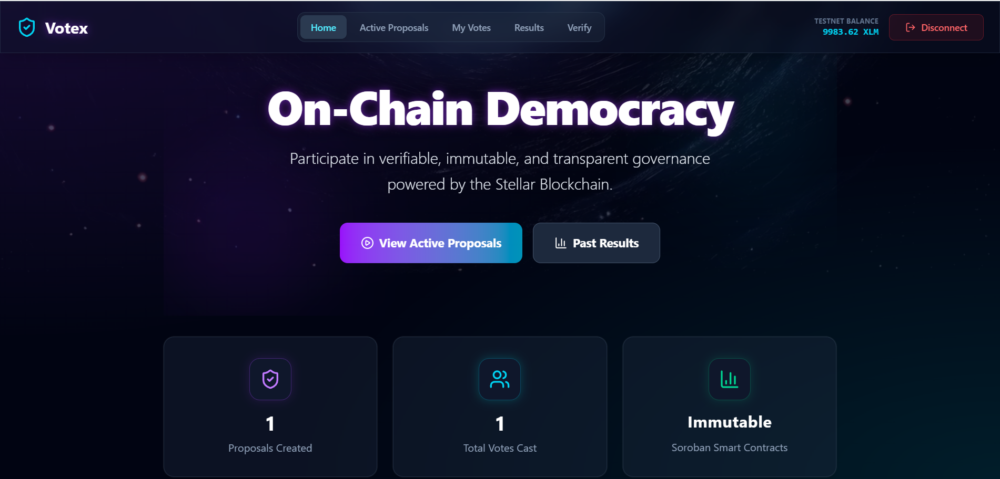
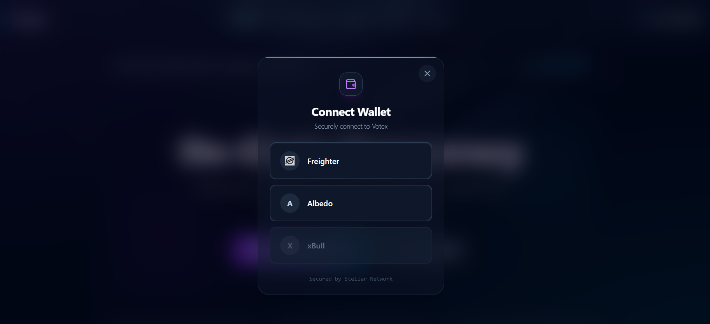
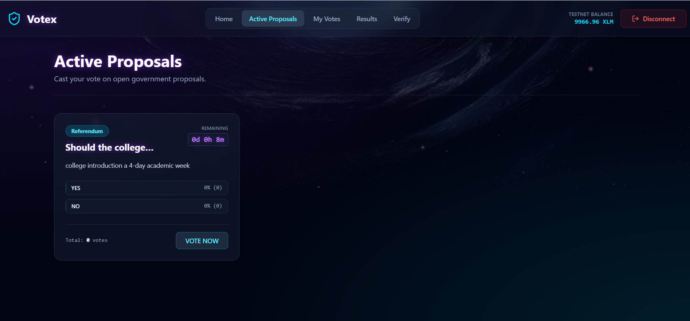
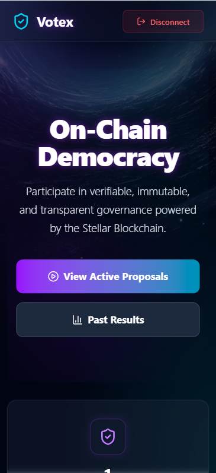
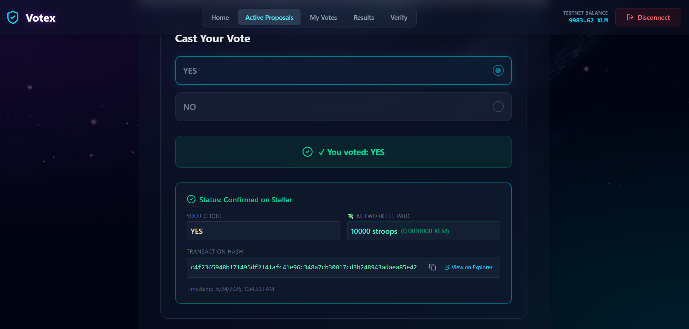
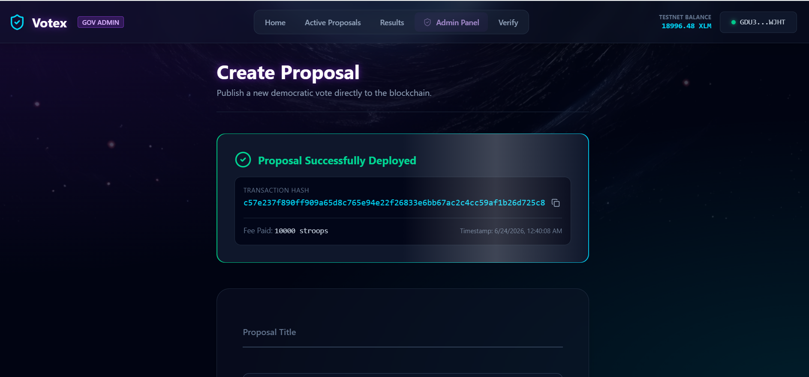
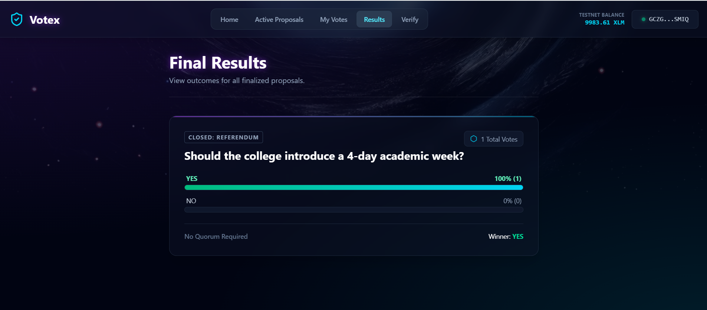

# Votex 

A Decentralized Voting & Governance Platform built on the Stellar Blockchain

Votex enables secure, transparent, and verifiable voting for elections, surveys, referendums, policy decisions, and budget approvals. Powered by Stellar and Soroban Smart Contracts, every vote is recorded on-chain, ensuring trust, transparency, and tamper-proof governance.

# 🚀 Live Demo

Demo Link: https://votex-ontc.vercel.app/

# 🎥 Demo Video

Watch Full Demo on YouTube:
[youtube](https://youtu.be/4sjdBQs5QQQ)

## 📜 Contract Information

| Item | Value |
|------|------|
| Network | Stellar Testnet |
| Contract ID | `CBMAFILZK4YTE2ZTDFOVLQZTFXG6SP23DXGGNZV6XV77JIG4UMNV4PUI` |
|TX hash|[view on stellar lab](https://lab.stellar.org/transaction/dashboard?$=network$id=testnet&label=Testnet&horizonUrl=https:////horizon-testnet.stellar.org&rpcUrl=https:////soroban-testnet.stellar.org&passphrase=Test%20SDF%20Network%20/;%20September%202015;&txDashboard$transactionHash=cac334fdbcff7acd46738c5ce32d9bb5d667518dcfd1d67c65015f28012cb628;;)
| Stellar Explorer | [View Contract](https://stellar.expert/explorer/testnet/contract/CBMAFILZK4YTE2ZTDFOVLQZTFXG6SP23DXGGNZV6XV77JIG4UMNV4PUI?filter=history) |

# ✨ Features
🗳️ Decentralized Voting
Elections
Referendums
Surveys
Policy Votes
Budget Approvals
🔒 Blockchain Verification
Every proposal recorded on Stellar
Every vote stored on-chain
Publicly verifiable transactions
Immutable voting records
👨‍💼 Admin Panel
Create governance proposals
Define voting duration
Add multiple voting options
Set voter eligibility requirements
Monitor voting participation
Track proposal history
👤 Voter Dashboard
View active proposals
Participate in governance decisions
Track voting history
Verify voting transactions
View final election results
💳 Wallet Integration
Freighter Wallet Support
Albedo Wallet Support
📊 Transparent Results
Automatic vote counting
Winner determination
Percentage-based result display
Total participation statistics
🔍 Vote Verification
Verify votes using transaction hash
Retrieve blockchain voting records
Independent vote validation
📱 Responsive UI
Desktop Friendly
Mobile Responsive
User-Friendly Interface

 ### 🛠️ Technology Stack & Languages

  #### 1. Smart Contract (Backend) —  /contract 

  • Language: Rust 🦀
  • SDK: Soroban SDK (v20.0.0)
  • Testing: Built-in unit testing suite leveraging  soroban_sdk::testutils

  #### 2. Frontend Application —  /frontend 

  • Languages: JavaScript (ES6+), HTML5, CSS3 (Vanilla + Tailwind CSS)
  • Framework: React 19 powered by Vite (v8.0.4)
  • Styling: Tailwind CSS (v4.2.2) combined with Framer Motion (v12.38.0) for glassmorphism UI & micro-animations       
  • Integrations:
      •  @stellar/stellar-sdk  (v15.0.1) — Core transaction building & Horizon interface
      •  @stellar/freighter-api  (v6.0.1) — Freighter Wallet integration
      •  @albedo-link/intent  (v0.13.0) — Albedo Wallet integration
      •  recharts  (v3.8.1) — Voting data visualizations
      •  lucide-react  (v1.8.0) — Outline icons

        ### 🚀 Local Run & Setup Guide

  #### Running Smart Contract Tests

    # Navigate to the contract directory
    cd contract

    # Run Rust unit tests
    cargo test Start the Vite hot-reloading development server:
    # Navigate to frontend folder
    cd frontend

    # Install dependencies
    npm install

    # Run local web server
    npm run dev

# 📸 Screenshots

## 🏠 Landing Page

---

## 👛 Wallet Selection

---

## 📝 Create Proposal

---

## 📱 Mobile Responsive View

---

## 🗳️ Successful Vote Submission

---

## 🔗 Transaction Hash Generated

---

## 📊 Voting Results

  # 🌍 Real-World Use Cases
🎓 Educational Institutions
Student elections
Faculty voting
Committee selection
🏢 Organizations
Governance decisions
Board voting
Internal surveys
🌐 Communities & DAOs
Proposal approvals
Treasury decisions
Community referendums
💼 Businesses
Policy approvals
Shareholder voting
Budget allocation
## CI/CD pipeline supporetd

