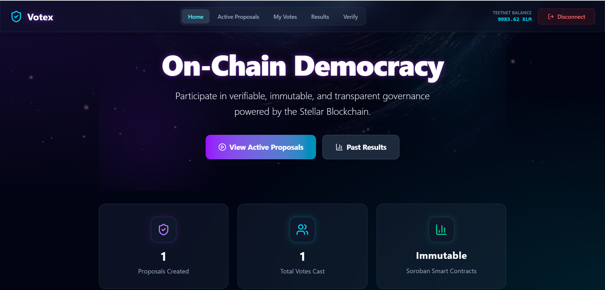
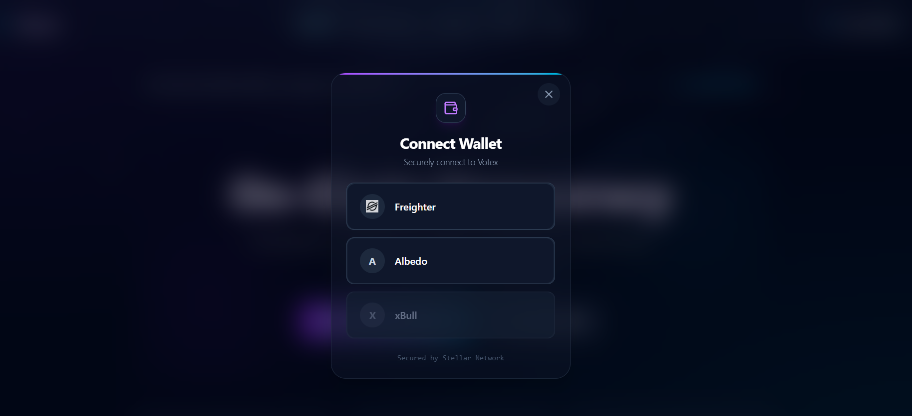
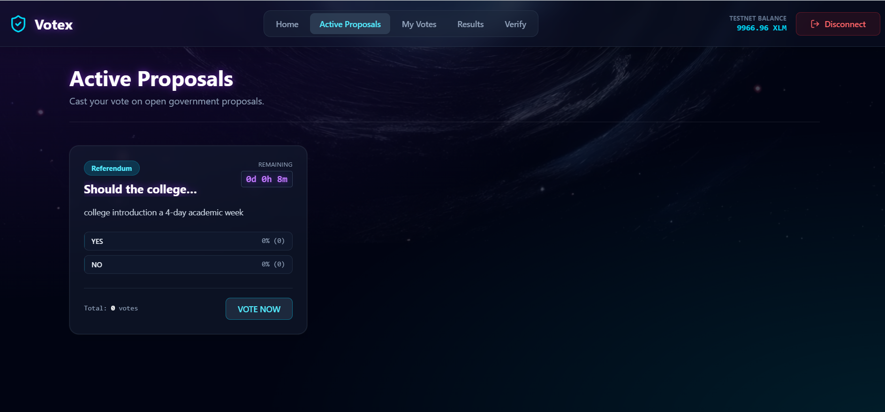
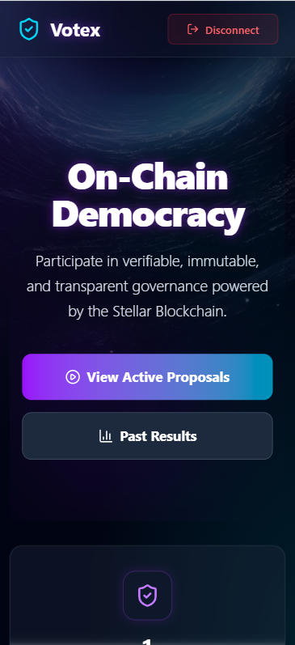
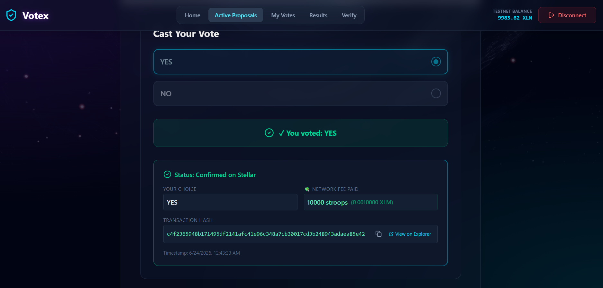
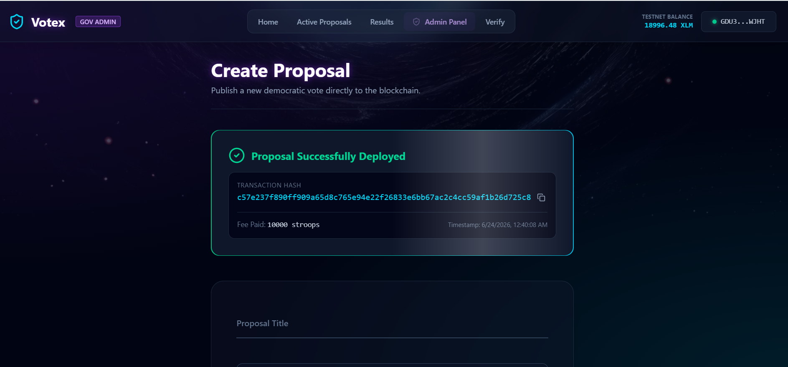
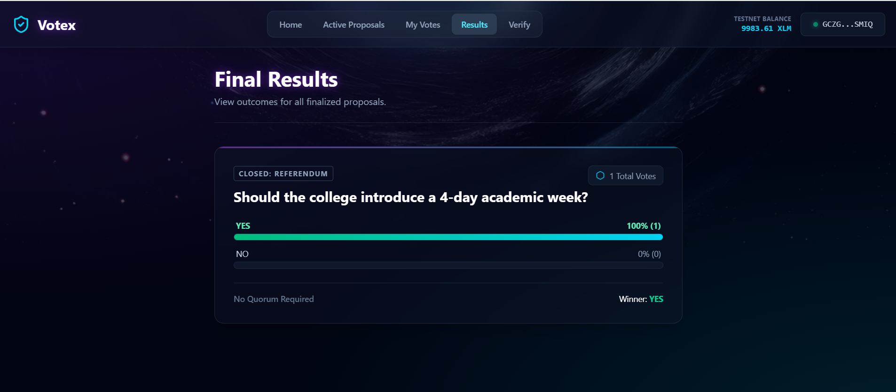

# Votex

**A Decentralized Voting & Governance Platform built on the Stellar Blockchain**

Votex enables secure, transparent, and verifiable voting for elections, surveys, referendums, policy decisions, and budget approvals. Powered by Stellar and Soroban Smart Contracts, every vote is recorded on-chain, ensuring trust, transparency, and tamper-proof governance.



---

## 🚀 Live Demo

**Demo Link:** https://votex-ontc.vercel.app/

## 🎥 Demo Video

Watch the full demo on YouTube: [youtube](https://youtu.be/4sjdBQs5QQQ)

## 📝 Feedback

- **Feedback Form:** [google form](https://docs.google.com/forms/d/e/1FAIpQLScnyBsMbnkr_3DwYCby6yVMwGWV0I0GcNUf2vGqIUEx6Tis0g/viewform)
- **Feedback Sheet:** [google sheet](https://docs.google.com/spreadsheets/d/1TpqnT-X-EdcRrufM_3DlYgDyYXKQTDA_kxg_HRiCQI0/edit?usp=sharing)

---
## User Feedback: 
| Name | Gmail | Wallet Address | Feedback |
|------|-------|----------------|----------|
| Gour Majumdar | majumdargour6@gmail.com | GCXM5UNIHALRP2HOCWFSGBLATSFFQLB5YZWCLIICKKELR3E7OCHZSLMF | "A proposal said Minimum Balance Required: 50000000 XLM. The admin only set 5 XLM. The number is shown in the wrong unit and it scared me off voting." |
| Pabon Dey | pabondey783@gmail.com | GCHKRVXHM3EECBD2KXZQYIMPIU4VTZHYYDJZKGAZO2VXPMHLJA275FOP | "I voted on my phone, then opened My Voting History on my laptop with the same wallet — it said 'You haven't voted yet.' My votes are on-chain; the page should read them from the contract, not just the browser." |
| Rahul Roy | rahulroy769@gmail.com | GB4EU73SY2J7KJAMTSZCFUER7XKMRUFR3IE3NWDNSFO754EIWUH5ITAB | "A friend sent me his transaction hash to verify his vote. I pasted it into the Verify page and got 'Record Not Found.' It only seems to find my own votes, so it isn't really public verification." |
| Dipa Das | dipadas62435@gmail.com | GDXACHTZWDCNWWUJZ6KQHOW3T2G34CQXNSMMIZJSZSOQUISUJBJC2OLT | "The countdown had already ended but the Cast Vote button was still active. I signed in Freighter, paid the fee, and only then it failed. The button should be disabled once voting closes." |
| Pratima Rudra | pratimarudra666@gmail.com | GAQFPTYZEI5RCBURZ7OAMGJYO6NHS7VYWZTNNYEPUOKU7QK5FELPOIYD | "Every failure shows the same message: 'Transaction failed or rejected.' I couldn't tell whether I had already voted, didn't have enough XLM, or just cancelled in the wallet." |
| Bijay Shanjar | bijayshankar2321@gmail.com | GAYUFZJBWTK3T5ZX47DILF43QUGPYFNIPBVTLYLF3CYVJVF54MCSS3G3| "Once it got stuck on 'Submitting to Chain...' forever. The spinner never stopped and I had to reload the page — I wasn't sure if my vote went through or not." |
| Moumita Das | moumitadas547@gmail.com | GDU34BU5VFLXSZHM5K4D737TYU6XBATENI5RXCI54UKERV6NITMSWJHT | "The confirm popup said estimated fee ~2,000 stroops but the receipt after signing said 10,000 stroops. The preview should match what I'm actually charged." |
| Prisha Dey | prishadey578@gmail.com | GBHPK2DOERC3I4A3HEJEXSA3SCYD4N7RX74JFXOKJT74S6ICQ4TGX4YH | "There's no search or filter on the Active Proposals page. With a screen full of proposals I had to scroll and read every card to find the election I wanted." |
| Lipika Dey | dlipika820@gmail.com | GBQLFIT7UWCURWEDBR5JPCQPFIFYJ23AKIX24P6MOAAZ3AIDTSNE24FY| "Two options had the same number of votes but the page still declared one of them the Winner with a green bar. A tie should be shown as a tie, not a win." |
| Arpita | dasarpita398@gmail.com | GCZG5HJBIDSOGZVXJMFNJTIQ5HAYR2SQGRUYT5GRMG6BHT2PNLPPSMIQ | "After a lot of test proposals and votes the app started failing to load proposals on testnet. Feels like the contract keeps everything in one storage entry that will hit its limit." |
| Riju Dey | deyriju724@gmail.com | GBEPCGCJHUDNPCIF53SHCQKDZHTCK66JBTT6F2B2VU5NNTD57SIYFC3U | "Good. I don't face any problem." |
----

## Feedback implementation: 
## Feedback Implementation

| User ID | Name | Email | Wallet Address | Feedback Summary | Improvement Made | Git Commit ID |
|---------|------|-------|----------------|------------------|------------------|---------------|
| U01 | Gour Majumdar | majumdargour6@gmail.com | GCXM5UNIHALRP2HOCWFSGBLATSFFQLB5YZWCLIICKKELR3E7OCHZSLMF | Minimum balance displayed as **50,000,000 XLM** instead of **5 XLM**. | Fixed minimum balance display by converting stroops to XLM before rendering. | `c3337c9` |
| U02 | Pabon Dey | pabondey783@gmail.com | GCHKRVXHM3EECBD2KXZQYIMPIU4VTZHYYDJZKGAZO2VXPMHLJA275FOP | Vote history disappeared when accessed from another device. | Read voting history directly from the smart contract instead of browser localStorage. | `6dd21cb` |
| U03 | Rahul Roy | rahulroy769@gmail.com | GB4EU73SY2J7KJAMTSZCFUER7XKMRUFR3IE3NWDNSFO754EIWUH5ITAB | Verify page could not verify another user's transaction hash. | Verification now checks votes against the blockchain instead of browser cache. | `c5b04de` |
| U04 | Dipa Das | dipadas62435@gmail.com | GDXACHTZWDCNWWUJZ6KQHOW3T2G34CQXNSMMIZJSZSOQUISUJBJC2OLT | Cast Vote button stayed active after proposal deadline. | Disabled voting UI automatically after proposal closes or deadline passes. | `49d5d70` |
| U05 | Pratima Rudra | pratimarudra666@gmail.com | GAQFPTYZEI5RCBURZ7OAMGJYO6NHS7VYWZTNNYEPUOKU7QK5FELPOIYD | Generic transaction error gave no useful information. | Added detailed transaction error reporting with actual contract failure reason. | `dfa6bca` |
| U06 | Bijay Shanjar | bijayshankar2321@gmail.com | GAYUFZJBWTK3T5ZX47DILF43QUGPYFNIPBVTLYLF3CYVJVF54MCSS3G3 | Transaction remained on "Submitting to Chain..." indefinitely. | Added timeout and bounded polling for transaction confirmation. | `a539f5e` |
| U07 | Moumita Das | moumitadas547@gmail.com | GDU34BU5VFLXSZHM5K4D737TYU6XBATENI5RXCI54UKERV6NITMSWJHT | Estimated fee differed from actual charged fee. | Display actual fee charged instead of maximum fee bid. | `23ecca7` |
| U08 | Prisha Dey | prishadey578@gmail.com | GBHPK2DOERC3I4A3HEJEXSA3SCYD4N7RX74JFXOKJT74S6ICQ4TGX4YH | Difficult to locate proposals without search or filters. | Added search, category filter, status filter, and sorting to Active Proposals. | `b8cc4b1` |
| U09 | Lipika Dey | dlipika820@gmail.com | GBQLFIT7UWCURWEDBR5JPCQPFIFYJ23AKIX24P6MOAAZ3AIDTSNE24FY | Tie between options incorrectly declared one winner. | Added tie detection and proper tie result handling. | `00bf332` |
| U10 | Arpita | dasarpita398@gmail.com | GCZG5HJBIDSOGZVXJMFNJTIQ5HAYR2SQGRUYT5GRMG6BHT2PNLPPSMIQ | Proposal loading failed after many proposals and votes due to storage limitations. | Moved proposals and vote records to persistent storage for better scalability. | `9e61666` |
| U11 | Riju Dey | deyriju724@gmail.com | GBEPCGCJHUDNPCIF53SHCQKDZHTCK66JBTT6F2B2VU5NNTD57SIYFC3U | No issues reported during testing. | Conducted onboarding feedback session and documented successful user experience. | `a916a73` |


## 📜 Contract Information

| Item | Value |
|------|-------|
| Network | Stellar Testnet |
| Contract ID | `CBMAFILZK4YTE2ZTDFOVLQZTFXG6SP23DXGGNZV6XV77JIG4UMNV4PUI` |
| TX Hash | [view on stellar lab](https://lab.stellar.org/transaction/dashboard?$=network$id=testnet&label=Testnet&horizonUrl=https:////horizon-testnet.stellar.org&rpcUrl=https:////soroban-testnet.stellar.org&passphrase=Test%20SDF%20Network%20/;%20September%202015;&txDashboard$transactionHash=cac334fdbcff7acd46738c5ce32d9bb5d667518dcfd1d67c65015f28012cb628;;) |
| Stellar Explorer | [View Contract](https://stellar.expert/explorer/testnet/contract/CBMAFILZK4YTE2ZTDFOVLQZTFXG6SP23DXGGNZV6XV77JIG4UMNV4PUI?filter=history) |

---


---

## ✨ Features

### 🗳️ Decentralized Voting
Elections · Referendums · Surveys · Policy Votes · Budget Approvals

### 🔒 Blockchain Verification
- Every proposal recorded on Stellar
- Every vote stored on-chain
- Publicly verifiable transactions
- Immutable voting records

### 👨‍💼 Admin Panel
- Create governance proposals
- Define voting duration
- Add multiple voting options
- Set voter eligibility requirements
- Monitor voting participation and proposal history

### 👤 Voter Dashboard
- View active proposals with search, category filter and sorting
- Participate in governance decisions
- Track voting history, read directly from the contract
- Verify voting transactions
- View final election results

### 💳 Wallet Integration
Freighter Wallet · Albedo Wallet

### 📊 Transparent Results
- Automatic vote counting with explicit tie detection
- Winner determination and quorum reporting
- Percentage-based result display
- Total participation statistics

### 🔍 Vote Verification
- Verify any wallet address or transaction hash against the network
- Retrieve blockchain voting records for any voter
- Independent vote validation

### 📱 Responsive UI
Desktop friendly · Mobile responsive · Accessible controls

---

## 🛠️ Technology Stack

### 1. Smart Contract (Backend) — `/contract`

- **Language:** Rust 🦀
- **SDK:** Soroban SDK (v20.0.0)
- **Storage:** Persistent storage per proposal and per vote, with TTL renewal on write
- **Testing:** Unit test suite using `soroban_sdk::testutils` (5 tests)

### 2. Frontend Application — `/frontend`

- **Languages:** JavaScript (ES6+), HTML5, CSS3 (Vanilla + Tailwind CSS)
- **Framework:** React 19 powered by Vite (v8.0.4)
- **Styling:** Tailwind CSS (v4.2.2) with Framer Motion (v12.38.0) for glassmorphism UI & micro-animations
- **Integrations:**
  - `@stellar/stellar-sdk` (v15.0.1) — transaction building & Horizon/RPC interface
  - `@stellar/freighter-api` (v6.0.1) — Freighter Wallet integration
  - `@albedo-link/intent` (v0.13.0) — Albedo Wallet integration
  - `recharts` (v3.8.1) — voting data visualizations
  - `lucide-react` (v1.8.0) — outline icons

---

## 🚀 Local Run & Setup Guide

### Smart Contract

```bash
cd contract

# Run Rust unit tests
cargo test

# Build the release WASM
cargo build --target wasm32-unknown-unknown --release
```

### Frontend

```bash
cd frontend

# Install dependencies
npm install

# Run the local dev server
npm run dev
```

The frontend reads `VITE_CONTRACT_ID`, `VITE_ADMIN_ADDRESS`, `VITE_RPC_URL` and `VITE_NETWORK_PASSPHRASE` from a `.env` file in `/frontend`.

---

## ⚙️ CI/CD Pipeline

Votex uses **GitHub Actions** for Continuous Integration on every push and pull request to `main`. The pipeline runs two jobs in parallel:

| Job | Scope | Steps |
|-----|-------|-------|
| **Contract Tests** | `/contract` (Rust/Soroban) | Run unit tests (`cargo test --features testutils`) → build release WASM (`wasm32-unknown-unknown`) |
| **Frontend Lint & Build** | `/frontend` (React/Vite) | `npm ci` → ESLint → production build (`npm run build`) |

**Deployment (CD):**
- **Frontend** is built and verified through continuous integration on every push to `main`.
- **Smart contract** is deployed to **Stellar Testnet** manually using the Stellar CLI. On-chain contract deployment is kept manual by design, since re-deploying changes the contract ID and requires a secret signing key.

This gives full automated verification (CI) for both layers while keeping blockchain deployment safe and controlled.

---

## 📸 Screenshots

### 🏠 Landing Page


### 👛 Wallet Selection


### 📝 Create Proposal


### 📱 Mobile Responsive View


### 🗳️ Successful Vote Submission


### 🔗 Transaction Hash Generated


### 📊 Voting Results


---

## 🌍 Real-World Use Cases

| Sector | Applications |
|--------|--------------|
| 🎓 **Educational Institutions** | Student elections · Faculty voting · Committee selection |
| 🏢 **Organizations** | Governance decisions · Board voting · Internal surveys |
| 🌐 **Communities & DAOs** | Proposal approvals · Treasury decisions · Community referendums |
| 💼 **Businesses** | Policy approvals · Shareholder voting · Budget allocation |
